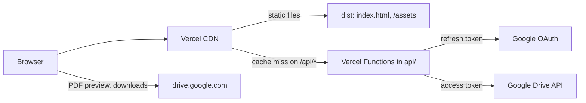
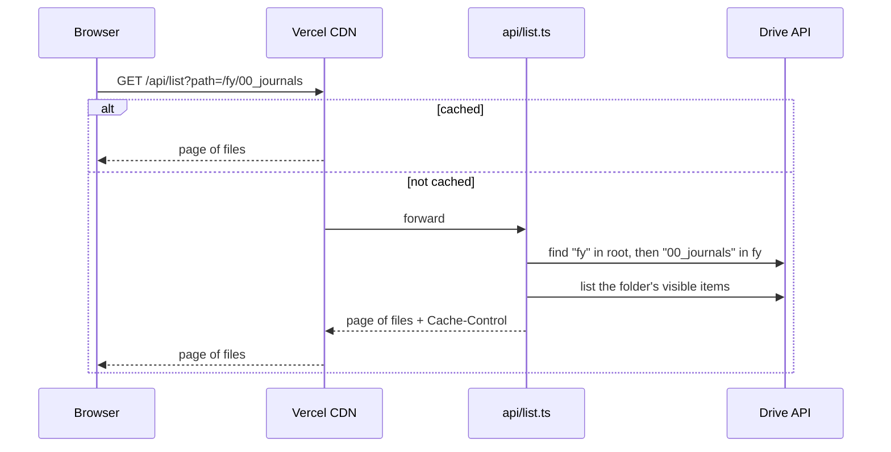
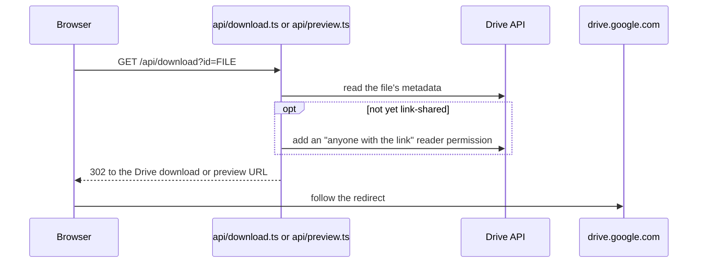

# Architecture

This document describes how the site works: the pieces it is made of, how a request moves through them, and the constraints that shaped them. [AGENTS.md](AGENTS.md) covers the conventions for changing the code.

## Overview

The site has three parts:

- **The web app** in `src/`, a React single-page app built by Vite and served as static files.
- **The API** in `api/`, a handful of Vercel Functions that talk to the Google Drive API with the owner's OAuth refresh token.
- **The shared contract** in `shared/`, the response schemas and path helpers that both sides import.

The browser never holds Google credentials. Every Drive call goes through a function, and the CDN caches function responses so most requests never reach a function at all.

## Request flows

### Opening a folder

Site URLs are folder names, not Drive IDs: `/fy/00_journals` is the `00_journals` folder inside `fy` at the Drive root. Each segment is one percent-encoded folder name (`shared/folder-path.ts`), so names containing `/`, `#` or quotes survive the round trip.

The function resolves the path one folder at a time and remembers resolved folder IDs for a few minutes per warm instance, so "Load More" on a deep folder usually costs a single Drive call. An unknown path answers 404, and the web app shows the same empty state as an empty folder.

### Downloading or previewing a file

Drive only serves a file anonymously once it is public, so the function grants the link permission the first time a file is requested and skips the write for files that are already public. Only files that listings and search can show are shared (see Visibility below), and that includes files search finds outside the root folder, since search results offer them for download. The redirect is cached at the CDN, so repeat downloads do not reach the function.

The download button opens the endpoint in a new tab synchronously inside the click handler, which keeps it clear of popup blockers. The preview modal points an `iframe` at `/api/preview`. When the endpoint answers with a JSON error instead of redirecting, the frame's document is our own `application/json` response, and the modal shows "Preview not available" in place of the frame.

### Opening a folder from search results

Search results come from anywhere in the Drive, so the result only knows the folder's ID. Selecting it calls `/api/path?id=...`, which walks the folder's parents up to the Drive root and returns the site URL for it.

## API

Every endpoint is a `GET` handler in `api/<name>.ts` built with `handleGet` from `api/_lib/http.ts`, which turns a thrown `HttpError` into a JSON error with the error's own cache policy and anything else into a logged 500.

| Endpoint        | Parameters          | Success response           | Purpose                                     |
| --------------- | ------------------- | -------------------------- | ------------------------------------------- |
| `/api/list`     | `path`, `pageToken` | `DrivePage`                | One page of a folder, folders first         |
| `/api/search`   | `q`, `pageToken`    | `DrivePage`                | Items whose names contain every search term |
| `/api/path`     | `id`                | `FolderPath`               | The site URL of a folder                    |
| `/api/download` | `id`                | 302 to the Drive download  | Download a file                             |
| `/api/preview`  | `id`                | 302 to the Drive previewer | Preview a file in the modal                 |

- **Contract.** The response shapes are valibot schemas in `shared/drive.ts`. The functions validate Google's responses against their own schemas in `api/_lib/drive.ts`, and the web app validates API responses against the shared ones in `src/api/drive.ts`. Types are inferred from the schemas, so the runtime check and the type cannot drift.
- **Visibility.** What appears in listings and search is defined once in `api/_lib/drive.ts`: trashed items, `.password` files, shortcuts, and Google Docs, Sheets, Forms and Sites files are hidden, and none of them or any folder is ever shared.
- **Queries.** Values interpolated into Drive `q` strings go through `quote`, which escapes backslashes and single quotes as the Drive query language requires. Search drops `!=`, double quotes and the characters `= < > / \ :` from the terms and splits on spaces, commas, pipes and brackets.
- **Paging.** The page size is `PAGE_SIZE` in `api/_lib/drive.ts`. A page token Drive rejects answers 400.
- **Caching.** Each endpoint sends a `Cache-Control` from `CACHE_CONTROL` in `api/_lib/http.ts`. `s-maxage` lets the Vercel CDN cache the response and `stale-while-revalidate` lets it answer instantly while refreshing in the background. A 404 carries the same policy as the response it stands in for, so a folder created after someone requested it can take that long to appear. Invalid requests and server errors are never cached.
- **Credentials.** `api/_lib/google.ts` exchanges the refresh token for an access token and reuses it until shortly before it expires. Concurrent requests share one refresh. The credentials come from the `VITE_GOOGLE_*` variables listed in `.env.example`. Only the functions read them, through `process.env`; the web app must never read them through `import.meta.env`, which would publish them in the bundle.

## Web app

- **Routes** live in `src/App.tsx`: `/search` renders `SearchPage`, `/404` renders `NotFoundPage`, and every other path renders `FolderPage` for that folder path.
- **Data** comes through `usePagedFiles` (`src/hooks/usePagedFiles.ts`), which loads the first page for a key, aborts and ignores stale requests when the key changes and appends pages on "Load More". A failed first page or a failed "Load More" sets `failed`, and the pages show `ErrorAlert` above whatever is already loaded. The pages pass it a loader from `src/api/drive.ts`.
- **Search state** is the URL. `SearchPage` reads `q`, and `Layout` owns the text in the search box and navigates on submit.
- **Components** in `src/components/` render what they are given and report user actions through callbacks. The exceptions hold state that belongs to them: `Layout` owns the header, the mobile menu and the search box, `FileList` owns the open preview, and `FileRow` and `FilePreview` start downloads through `useDownload`. The pages give `FileList` a `key` per folder or query, so that state resets on navigation.

### Styling

- Mantine provides the components and the theme (`src/theme.ts`). Everything else is a CSS module next to its component.
- `src/styles/mantine.css` imports only the Mantine stylesheets the app uses, in the order Mantine's own bundle uses. `vite/mantine-css.test.ts` recomputes the required list from the components imported in `src/` and their internal dependencies, and fails when one is missing or out of order.
- Colours come from the theme through Mantine CSS variables, with `alpha()` from postcss-preset-mantine for translucent ones.
- `src/main.tsx` imports the Mantine styles before anything else. CSS modules override Mantine's classes at equal specificity only because they come later in the bundle.
- Icons are re-exported from `src/icons.ts`, one module per icon, because importing from the `@tabler/icons-react` entry point makes the dev server send every icon to the browser.

## Testing

| Layer                    | Where                             | Runs with                        |
| ------------------------ | --------------------------------- | -------------------------------- |
| API and shared helpers   | `api/_tests/`, `shared/*.test.ts` | Vitest, `node` project           |
| Components, hook, client | `src/**/*.test.ts(x)`             | Vitest, `web` project with jsdom |
| Tooling guards           | `vite/*.test.ts`                  | Vitest, `node` project           |
| Visual regression        | `e2e/visual.spec.ts`              | Playwright                       |
| Navigation flows         | `e2e/navigation.spec.ts`          | Playwright                       |

- The API tests replace `fetch` with an in-memory Drive (`api/_tests/fake-google.ts`), so they exercise the real query building and parsing.
- The Playwright tests run against the production build with `/api/*` answered from a fixture tree (`e2e/fixtures/drive.ts`), so they need no credentials and always see the same data.
- The browser runs in the official Playwright Docker image (`pnpm playwright:server`), locally and in CI, so fonts and anti-aliasing are identical everywhere and screenshots can be compared pixel for pixel.
- The screenshots in `e2e/__screenshots__/` define how the site looks. Any pixel difference fails the suite. Regenerate them with `pnpm test:e2e --update-snapshots` only for an intended visual change, and review the image diffs in the pull request.

## Tooling

- **TypeScript** is split into three projects referenced from `tsconfig.json`: `tsconfig.app.json` for the browser code, `api/tsconfig.json` for the functions and `tsconfig.node.json` for configs, scripts and end-to-end tests.
- **Vercel's function build** compiles each `api/*.ts` entry with the project's own TypeScript, using a temporary config that extends the nearest `tsconfig.json`, which is `api/tsconfig.json`. That is why it sets `typeRoots`: without it the temporary config cannot find `@types/node` and the build log shows an error.
- **Lint** is oxlint with type-aware rules; warnings fail. The preview `iframe` needs `allow-same-origin` in its sandbox or the Drive viewer renders blank, so `react/iframe-missing-sandbox`, which rejects that token, is off for `src/components/FilePreview.tsx` only. A successful preview ends on the Drive viewer, which is cross-origin, and a failed one on a JSON body from our own origin sent with `X-Content-Type-Options: nosniff`, so no page in the frame can lift its own sandbox.
- **Format** is oxfmt, which also sorts imports.
- **pnpm** is pinned to a version Dependabot can run. Dependabot cannot yet read the lockfile written by newer majors ([dependabot-core#16095](https://github.com/dependabot/dependabot-core/issues/16095)).
- **`@types/node`** stays on the major of the Node.js runtime pinned in `engines`, and Dependabot is told not to raise it.
- **Mantine** packages are pinned to one exact version because `@mantine/core` declares an exact peer dependency on `@mantine/hooks`.

## Deployment

Vercel builds each deployment with `pnpm build` and deploys `dist/` plus one function per `.ts` file directly in `api/` whose name does not start with `_`. `vercel.json` rewrites every non-API path to `index.html` so client routes load directly, marks the content-hashed files in `/assets` as immutable, and sends `X-Content-Type-Options: nosniff` on every response.

CI (`.github/workflows/ci.yml`) runs formatting, lint, type-checking, unit tests and the build in one job, and the Playwright suite in another.
