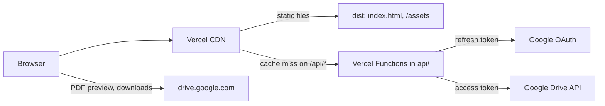
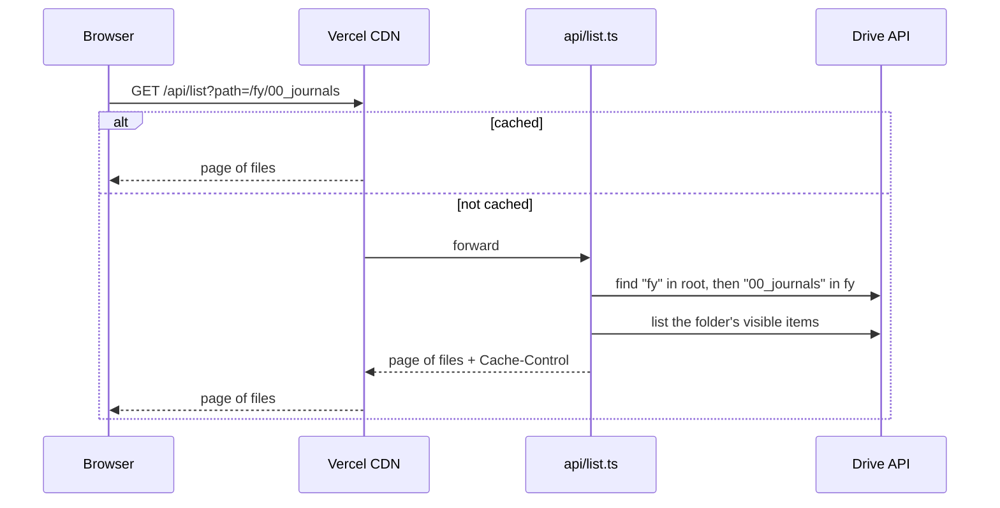
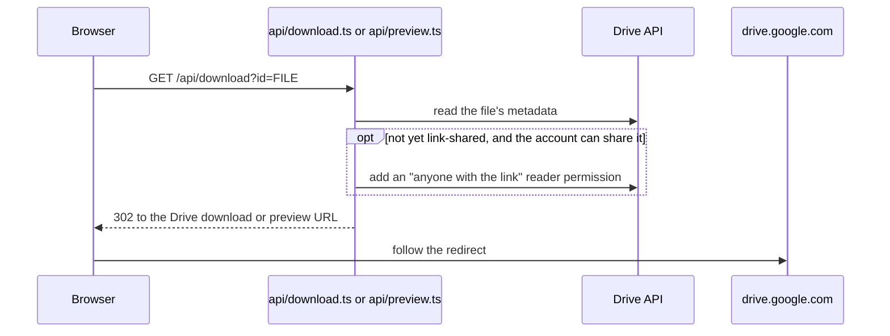

# Architecture

This document describes how the site works: the pieces it is made of, how a request moves through them, and the constraints that shaped them. [AGENTS.md](AGENTS.md) covers the conventions for changing the code.

## Overview

The site has three parts:

- **The web app** in `src/`, a React single-page app built by Vite and served as static files.
- **The API** in `api/`, a handful of Vercel Functions that talk to the Google Drive API with the owner's OAuth refresh token.
- **The shared contract** in `shared/`, the response schemas and path helpers that both sides import.

The browser never holds Google credentials. Every Drive call goes through a function, and the CDN caches function responses so most requests never reach a function at all.

## Request flows

### Opening a folder

Site URLs are folder names, not Drive IDs: `/fy/00_journals` is the `00_journals` folder inside `fy` at the Drive root. Each segment is one percent-encoded folder name (`shared/folder-path.ts`), so names containing `/`, `#` or quotes survive the round trip. Because the URL holds names, sibling folders with the same name share a URL, and it opens the oldest of them (lookups are ordered by `createdTime`); the others can only be reached by renaming them in Drive.

The function resolves the path one folder at a time and remembers resolved folder IDs for a few minutes per warm instance, so "Load More" on a deep folder usually costs a single Drive call. A remembered ID can belong to a folder deleted since, whose items Drive then lists as trashed, so a page that comes back empty makes the function resolve the path again without the remembered IDs: if the folder is gone it answers 404, if the path now leads to another folder of the same name it lists that one (or rejects the page token, so the web app starts again from its first page), and otherwise the folder really is empty. An unknown path answers 404, and the web app shows its not found page at that URL.

### Downloading or previewing a file

Drive only serves a file anonymously once it is public, so the function grants the link permission the first time a file is requested and skips the write for files that are already public. Only files that listings and search can show are shared (see Visibility below), and that includes files search finds outside the root folder, since search results offer them for download. Search also finds files that others shared with the account as a viewer, which the account cannot share (`capabilities.canShare` is false). The function redirects to those without writing, and Drive decides whether the visitor may open them. The redirect is cached at the CDN, so repeat downloads do not reach the function.

The download button opens the endpoint in a new tab synchronously inside the click handler, which keeps it clear of popup blockers. Both endpoints answer errors with a short HTML page instead of JSON, because the browser shows that response to the visitor: in the new tab for a download, or in the frame for a preview. The preview modal points an `iframe` at `/api/preview`. When the frame loads a document titled `FILE_LINK_ERROR_TITLE` (`shared/drive.ts`), the endpoint answered with its error page, and the modal shows "Preview not available" in place of the frame. A successful preview ends on the cross-origin Drive viewer, whose document the page cannot read, so any other load counts as success.

### Opening a folder from search results

Search results come from anywhere in the Drive, so the result only knows the folder's ID. Selecting it calls `/api/path?id=...`, which walks the folder's parents up to the Drive root and returns the site URL for it. The row says the folder is opening while the lookup runs. Search covers every Drive the account can read, so a result can be a folder that is not under the root at all: one in a shared drive, one shared with the account, or one moved or deleted since. `/api/path` answers 404 for those, and also for a folder whose path would open a different folder (see the next paragraph), and the row then says the folder can't be opened here. When the lookup fails, the row says so and selecting it again retries.

## API

Every endpoint is a `GET` handler in `api/<name>.ts` built with `handleGet` from `api/_lib/http.ts`, which turns a thrown `HttpError` into an error response with the error's own cache policy and anything else into a logged 500. Errors are JSON, except for the download and preview links, which answer with an HTML page.

| Endpoint        | Parameters                      | Success response           | Purpose                                   |
| --------------- | ------------------------------- | -------------------------- | ----------------------------------------- |
| `/api/list`     | `path`, `pageToken`, `rejected` | `DrivePage`                | One page of a folder, folders first       |
| `/api/search`   | `q`, `pageToken`, `rejected`    | `DrivePage`                | Items whose names match every search term |
| `/api/path`     | `id`                            | `FolderPath`               | The site URL of a folder                  |
| `/api/download` | `id`                            | 302 to the Drive download  | Download a file                           |
| `/api/preview`  | `id`                            | 302 to the Drive previewer | Preview a file in the modal               |

- **Contract.** The response shapes are valibot schemas in `shared/drive.ts`. The functions validate Google's responses against their own schemas in `api/_lib/drive.ts`, and the web app validates API responses against the shared ones in `src/api/drive.ts`. Types are inferred from the schemas, so the runtime check and the type cannot drift.
- **Visibility.** What appears in listings and search is defined once in `api/_lib/drive.ts`: trashed items, `.password` files, shortcuts, and Google Docs, Sheets, Forms and Sites files are hidden, and none of them or any folder is ever shared.
- **Queries.** Values interpolated into Drive `q` strings go through `quote`, which escapes backslashes and single quotes as the Drive query language requires. Search drops `!=`, double quotes and the characters `= < > / \ :` from the terms and splits on whitespace, commas (including the full-width `，`), pipes, parentheses and braces. Each term becomes a `name contains` clause, which Drive matches against the start of a word in the name: Google's own example is that `Hello` finds `HelloWorld` and `World` does not, and against the notes Drive `journal` finds `am_journal.pdf` while `ournal` finds nothing.
- **Paging.** The page size is `PAGE_SIZE` in `api/_lib/drive.ts`. A page token Drive rejects answers 400. Drive keeps a page token valid for several hours, so the listing policy keeps a cached page, and the token in it, at most `s-maxage` plus `stale-while-revalidate` (65 minutes) old. Drive's docs say to discard a rejected token and start again from the first page, which the web app does (see Data below). The restarted first page carries the rejected token as `rejected`, which the functions ignore: it only gives the request its own CDN cache key, so the CDN cannot answer it with the same cached page and the same rejected token again.
- **Caching.** Each endpoint sends a `Cache-Control` from `CACHE_CONTROL` in `api/_lib/http.ts`. `s-maxage` lets the Vercel CDN cache the response and `stale-while-revalidate` lets it answer instantly while refreshing in the background. Listings, search results and folder paths can therefore be out of date: a new or renamed item shows up within `s-maxage` while a URL is requested often, and the first request after a quiet period can still get a copy up to `s-maxage` plus `stale-while-revalidate` old, which triggers the refresh. A 404 from `/api/list` or `/api/path` carries the same policy as the response it stands in for, so a folder created after someone requested it takes as long. A download or preview link for a missing file answers 404 with the listing policy, since it reflects the same Drive state a listing does. Invalid requests and server errors are never cached.
- **Credentials.** `api/_lib/google.ts` exchanges the refresh token for an access token and reuses it until shortly before it expires. Concurrent requests share one refresh. The credentials come from the `VITE_GOOGLE_*` variables listed in `.env.example`. Only the functions read them, through `process.env`; the web app must never read them through `import.meta.env`, which would publish them in the bundle.

## Web app

- **Routes** live in `src/App.tsx` and `src/config.ts`. `/search` with a non-empty `q` is the search page; every other path, `/search` without a query included, renders `FolderPage` for that folder path, which shows `NotFoundPage` when `/api/list` answers 404. Top-level folders named `search` or `404` therefore open like any other. The deployment answers a few paths before the app sees them, so these folders can't be opened by URL: anything inside a top-level folder named `api` (the functions answer `/api/*`), anything inside a top-level folder named `assets` (the built files are served from `/assets/*`, and any other path there is a plain 404, so a stale bundle name never gets the app's HTML), and a top-level folder named like a file in `public/`, such as `robots.txt`.
- **Data** comes through `usePagedFiles` (`src/hooks/usePagedFiles.ts`), which loads the first page for a key and appends pages on "Load More". Every request for a key, including the pages "Load More" fetches one after another, shares one `AbortController` that is aborted when the key changes or the page unmounts, so no request or page loop outlives the page that started it. When the API rejects a page token, `src/api/drive.ts` throws `RejectedPageTokenError` and the hook starts again from the first page, loading until it has more items than were shown. The restarted pages replace the list only once they are complete, so the visible list never shrinks while they load and stays as it was if one fails. A failed first page or a failed "Load More" sets `failed`. The pages show `ErrorAlert` at the top when nothing loaded, and `FileList` shows it between the loaded items and the "Load More" button when a later page fails, where the visitor is looking. `FileList` shows the empty state only when a load succeeded with no items, never after a failure. The pages pass it a loader from `src/api/drive.ts`, which returns `null` for a key the API answers 404 for, on the first page or a later one; the hook reports that as `missing`, and `FolderPage` shows the not found page.
- **Page titles** come from `usePageTitle` (`src/hooks/usePageTitle.ts`), which sets `document.title` to the folder name, `Search: <query>` or `Page not found`, followed by `site.title`, spelled `MITAOE` like the `index.html` title; the home page keeps the title from `index.html`. The footer's `site.companyName` keeps the old UI's `MITAoE`, which the screenshots show. Every route is served as `index.html` with status 200, so the not found view also renders `<meta name="robots" content="noindex">`, which React places in `<head>`, as Google advises for single-page apps.
- **Search state** is the URL. `useSearchQuery` (`src/hooks/useSearchQuery.ts`) reads the trimmed `q` on the search route, `SearchPage` searches for it, and `Layout` owns the text in the search box, fills it with `q` whenever the search page opens on a new query, empties it when another page opens, and navigates on submit. The box accepts at most `MAX_SEARCH_LENGTH` characters, the limit `/api/search` enforces, so only a link written by hand can carry a longer `q`; `SearchPage` does not send it, explains the limit, and the box shows its first `MAX_SEARCH_LENGTH` characters.
- **Components** in `src/components/` take their data as props and report user actions through callbacks. The state they hold is their own UI state: `Layout` owns the mobile menu and the search box, `FileList` the open preview and the "Load More" progress, `FilePreview` whether the frame loaded, `BreadcrumbNav` its scroll buttons and `SearchBar` its focus. The preview steps through the PDFs `FileList` has loaded. "Next" on the last one keeps loading pages until a PDF after the current one has loaded and opens it, so the preview reaches every PDF in a folder or search; it is disabled once there are no more pages, and a failed load shows an error inside the preview. `FileList` reads the current path for the breadcrumbs, and `FileRow` and `FilePreview` start downloads through `useDownload`. `Layout` gives the page a `key` per navigation, so every visit mounts it afresh, including a resubmitted search or a click on the current breadcrumb: the page loads again, which is how "Please try again" works, and state or pending requests from the previous visit are dropped.

### Styling

- Mantine provides the components and the theme (`src/theme.ts`). Everything else is a CSS module next to its component.
- `src/styles/mantine.css` imports only the Mantine stylesheets the app uses, in the order Mantine's own bundle uses. `vite/mantine-css.test.ts` recomputes the required list from the components imported in `src/` and their internal dependencies, and fails when one is missing, unused or out of order.
- Colours come from the theme through Mantine CSS variables, with `alpha()` from postcss-preset-mantine for translucent ones.
- `src/main.tsx` imports the Mantine styles before anything else. CSS modules override Mantine's classes at equal specificity only because they come later in the bundle.
- Icons are re-exported from `src/icons.ts`, one module per icon, because importing from the `@tabler/icons-react` entry point makes the dev server send every icon to the browser.

## Testing

| Layer                    | Where                             | Runs with                        |
| ------------------------ | --------------------------------- | -------------------------------- |
| API and shared helpers   | `api/_tests/`, `shared/*.test.ts` | Vitest, `node` project           |
| Components, hook, client | `src/**/*.test.ts(x)`             | Vitest, `web` project with jsdom |
| Tooling guards           | `vite/*.test.ts`                  | Vitest, `node` project           |
| Visual regression        | `e2e/visual.spec.ts`              | Playwright                       |
| Navigation flows         | `e2e/navigation.spec.ts`          | Playwright                       |

- The API tests replace `fetch` with an in-memory Drive (`api/_tests/fake-google.ts`) that evaluates the `q` strings the functions build, so they exercise the real query building and parsing. Like Drive, it matches `name contains` against the start of the name or of any word in it, and it ignores case; the Drive docs show the word matching by example and do not specify case or where words split. The real Drive splits at `_` (see Queries above), and the fake splits on anything that is not a letter or digit.
- The Playwright tests run against the production build with `/api/*` answered from a fixture tree (`e2e/fixtures/drive.ts`), so they need no credentials and always see the same data. Its search matches each whitespace-separated term against the start of a word, like the API fake. The download and preview mocks answer directly instead of redirecting to Drive: in this setup the browser follows a redirect from a mocked response without passing the target through the routes again, so it would load the real drive.google.com.
- The browser runs in the official Playwright Docker image (`pnpm playwright:server`), locally and in CI, so fonts and anti-aliasing are identical everywhere and screenshots can be compared pixel for pixel.
- The screenshots in `e2e/__screenshots__/` define how the site looks. Any pixel difference fails the suite. Regenerate them with `pnpm test:e2e --update-snapshots` only for an intended visual change, and review the image diffs in the pull request.

## Tooling

- **TypeScript** is split into three projects referenced from `tsconfig.json`: `tsconfig.app.json` for the browser code, `api/tsconfig.json` for the functions and `tsconfig.node.json` for configs, scripts and end-to-end tests.
- **Vercel's function build** compiles each `api/*.ts` entry with the project's own TypeScript, using a temporary config that extends the nearest `tsconfig.json`, which is `api/tsconfig.json`. That is why it sets `typeRoots`: without it the temporary config cannot find `@types/node` and the build log shows an error.
- **Lint** is oxlint with type-aware rules; warnings fail. The preview `iframe` needs `allow-same-origin` in its sandbox or the Drive viewer renders blank, so `react/iframe-missing-sandbox`, which rejects that token, is off for `src/components/FilePreview.tsx` only. A successful preview ends on the Drive viewer, which is cross-origin, and a failed one on our own error page, whose `Content-Security-Policy` allows no scripts, so no page in the frame can lift its own sandbox.
- **Format** is oxfmt, which also sorts imports.
- **pnpm** stays on the latest release of major 11. pnpm 12 writes `pnpm-lock.yaml` as two YAML documents, and GitHub's dependency graph, which Dependabot security alerts are built on, reads only the first one, so it sees no dependencies ([dependabot-core#15904](https://github.com/dependabot/dependabot-core/issues/15904)). The only workaround, `pmOnFail: ignore`, also turns off pnpm's check of the `packageManager` version.
- **`@types/node`** stays on the major of the Node.js runtime pinned in `engines`, and Dependabot is told not to raise it.
- **Mantine** packages are pinned to one exact version because `@mantine/core` declares an exact peer dependency on `@mantine/hooks`. Dependabot puts every `@mantine/*` update, majors included, in one `mantine` group, listed first because a dependency joins the first group it matches, so the packages always move together.

## Deployment

Vercel builds each deployment with `pnpm build` and deploys `dist/` plus one function per `.ts` file directly in `api/` whose name does not start with `_`. `vercel.json` rewrites every path outside `/api/` and `/assets/` to `index.html` so client routes load directly (Vercel serves existing files before applying rewrites), marks the content-hashed files in `/assets` as immutable, and sends `X-Content-Type-Options: nosniff` on every response.

Because the same `index.html` serves every route, it carries no `rel="canonical"` link and no `og:url`: one static value would tell search engines and link previews that every folder is the home page. Without them, Google chooses the canonical URL itself. `public/sitemap.xml` lists only the home page, since folders are reached through it and the search page has nothing to index without a query.

CI (`.github/workflows/ci.yml`) runs formatting, lint, type-checking, unit tests and the build in one job, and the Playwright suite in another.
